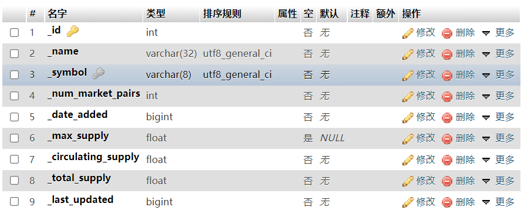
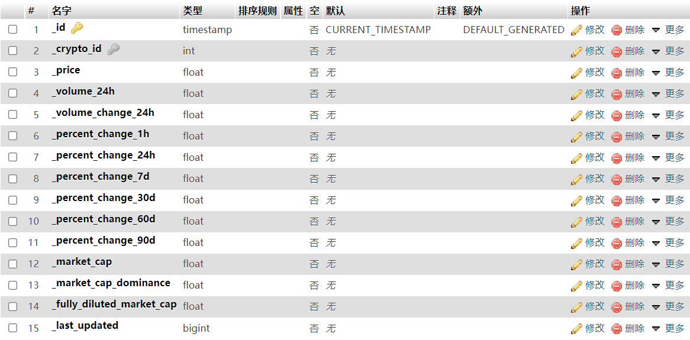

# coin的后端python程序
## 文件
目前三个文件，main是之后持续运行的主程序，每隔五分钟更新一次数据。dataGrabber是爬取虚拟货币数据的爬虫，sqlController是用来操作数据库的工具。之后还需要添加一个netServer用来处理客户端的请求。
### dataGrabber
这个基本就这样了没啥好写的。每次爬取到的数据大概长这样：
```json
{
    'id': 1, 
    'name': 'Bitcoin', 
    'symbol': 'BTC', 
    'slug': 'bitcoin', 
    'num_market_pairs': 8341, 
    'date_added': '2013-04-28T00:00:00.000Z', 
    'max_supply': 21000000, 
    'circulating_supply': 18887343, 
    'total_supply': 18887343, 
    'is_active': 1, 
    'platform': None, 
    'cmc_rank': 1, 
    'is_fiat': 0, 
    'last_updated': '2021-11-30T17:14:10.000Z', 
    'quote': 
    {
        'USD': 
        {
            'price': 56850.11343342416, 
            'volume_24h': 39517373968.77659, 
            'volume_change_24h': 22.6187, 
            'percent_change_1h': -0.30333488, 
            'percent_change_24h': -1.85333112, 
            'percent_change_7d': -0.7809746, 
            'percent_change_30d': -6.21907755, 
            'percent_change_60d': 19.72236889, 
            'percent_change_90d': 17.0509333, 
            'market_cap': 1073747592005.9897, 
            'market_cap_dominance': 41.3978, 
            'fully_diluted_market_cap': 1193852382101.91, 
            'last_updated': '2021-11-30T17:14:10.000Z'
        }
    }
}
```
每次获取到的数据已经传到sqlController里了，怎么用直接看sqlController里写的。
### sqlController
已经写好了写入和更新Crypto基本数据的example，quote如何写入和更新还没有写。读取还没有写。
## 数据库定义
注意，所有键名之前都加了一个下划线“_”。
### crypto表

记录是唯一的，只会更新不会删除或者增加。键名直接和之前爬到的数据对应，没有的行就是没存。里面时间全部都是先转换成timestamp再转换成bigint存储，详见sqlController代码。
### quote表

和crypto表是一对多关系（一个crypto对多个quote），每次新获取到的数据都新建一条quote记录。_crypto_id是外键，和crypto表的_id相连接，用于表示这个quote记录属于哪个虚拟货币。